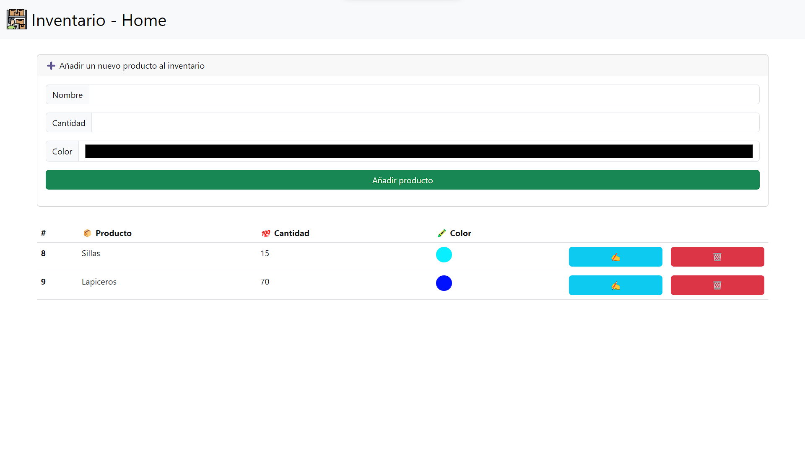
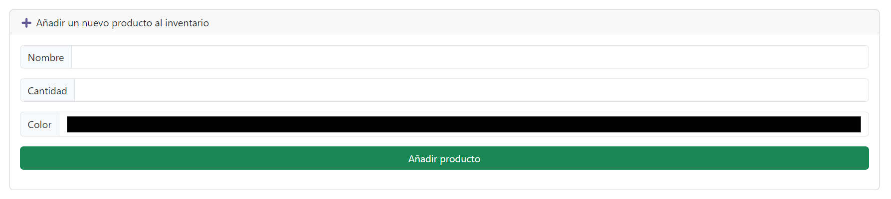
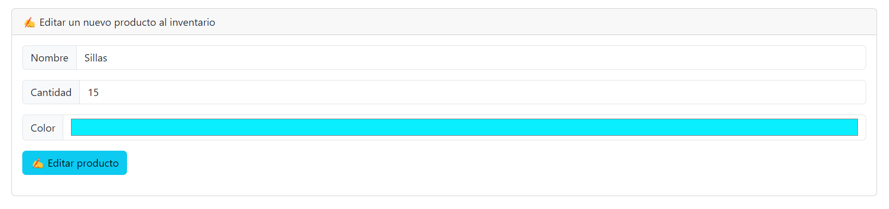

# Inventario 📦

Este es un proyecto para hacer un inventario, pensado en inventarios de Instituciones Educativas las cuales no logran organizar bien sus datos.

## Leer 🤓

    const read = (connection, callback) => {
        connection.query(`select * from ${table}`, (err, result) => {
            if (err) throw err;
            callback(result);
        });
    };

La funcionalidad es la siguiente, el servidor Express se conecta a MySql para leer los datos.

    +----+-----------+----------+---------+
    | id | nombre    | cantidad | color   |
    +----+-----------+----------+---------+
    |  8 | Sillas    |       15 | #0aefff |
    |  9 | Lapiceros |       70 | #0011ff |
    +----+-----------+----------+---------+

Mostrandose en pantalla gracias a Express Handlebars 🥸

## Crear ✔️

La creación se hace desde el recuadro del comienzo.

Se añade con el sigiente código el cuál se llama, ejecuta y añade a la base de datos.

    const add = (nombre, cant, color, connection) => {
        connection.query(
            `insert into ${table} (nombre, cantidad, color) values ('${nombre}', '${cant}', '${color}');`,
            (err) => {
                if (err) throw err;
            }
        );
    };

## Eliminar ❌

    const eliminar = (id, connection) => {
        connection.query(`delete from ${table} where id=${id}`, (err) => {
            if (err) throw err;
        });
    };

La eliminación es sencilla, desde el botón ubicado al final de cada fila aparece un botón rojo, el cuál dándole click, elimina el producto y sus caractarísticas.

## Editar ✍️

    const editar = (id, nombre, cantidad, color, connection) => {
        connection.query(
            `update ${table} set nombre='${nombre}', cantidad='${cantidad}', color='${color}' where id=${id}`,
            (err) => {
                if (err) throw err;
            }
        );
    };

En la edición es diferente, al darle click al ✍️

Redirecciona al usuario a la página de edición donde se autocompletan valores para que el usuario sólo cambie los valores deseados.

Una vez los datos cambiados, al dar el el botón "✍️ Editar producto" redirecciona y se pueden ver cambios en la página principal.

## Instalación

Con todo lo anterior la manera más sencilla de descargarlo es la siguiente:

    git clone https://github.com/Letalandroid/inventario

Luego de eso crear una base de datos en MySql con el comando de nombre 'Inventario' y la tabla productos.

    CREATE DATABASE inventario;
    USE inventario;
    CREATE TABLE productos;

Para seguido colocar los siguientes valores a la tabla productos.

    +----------+-------------+------+-----+---------+----------------+
    | Field    | Type        | Null | Key | Default | Extra          |
    +----------+-------------+------+-----+---------+----------------+
    | id       | int(11)     | NO   | PRI | NULL    | auto_increment |
    | nombre   | varchar(50) | NO   |     | NULL    |                |
    | cantidad | int(11)     | NO   |     | NULL    |                |
    | color    | varchar(10) | NO   |     | NULL    |                |
    +----------+-------------+------+-----+---------+----------------+

Con ello hecho ya podrías comenzar a usar el inventario de forma local.